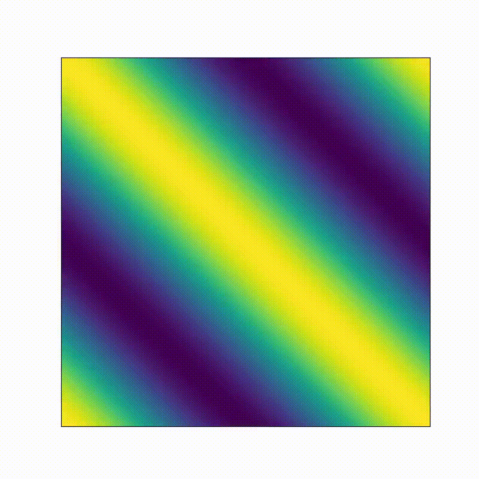

# About
Solving the 3D heat equation  with a finite difference method.
 

At the simulation results are compared with the analytical solution for sanity check.
The difference `L2_norm` will be printed out in the standard output.

# Parallelization

# Run
## heat3d
You can set the problem size (resolution), the number of iteration and the frequency of diagnostics.  
- `nx`: The number of grid points in x direction. (default: 128)  
- `ny`: The number of grid points in y direction. (default: 128)    
- `nz`: The number of grid points in z direction. (default: 128)  
- `nbiter`: The number of iterations of simulations. (default: 1000)  
- `freq_diag`: The diagnostics is made for every `freq_diag` step. (default: 10)

## heat3d_mpi
You can set the problem size (resolution), the MPI domain decomposition, the number of iteration and the frequency of diagnostics.  
- `nx`: The number of grid points in x direction. (default: 128)  
- `ny`: The number of grid points in y direction. (default: 128)    
- `nz`: The number of grid points in z direction. (default: 128)  
- `px`: The number of MPI processes in x direction. (default: 2)  
- `py`: The number of MPI processes in y direction. (default: 2)    
- `pz`: The number of MPI processes in z direction. (default: 2)  
- `nbiter`: The number of iterations of simulations. (default: 1000)  
- `freq_diag`: The diagnostics is made for every `freq_diag` step. (default: 10)

It should be noted that the total MPI processes `nb_procs` must be eqaul to `px * py * pz`.
If we set `px = 1`, then MPI communication along x direction is suppressed and replaced by swapping halo regions. 
