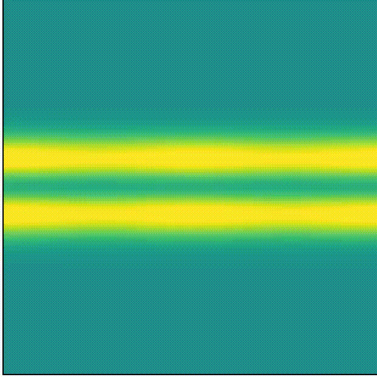

# vlp4d code

## Brief description
The vlp4d code solves Vlasov-Poisson equations in 4D (2d space, 2d velocity). 
From the numerical point of view, vlp4d is based on a semi-lagrangian scheme. 
Vlasov solver is typically based on a directional Strang splitting. The Poisson equation is treated with 2D Fourier transforms. 
For the sake of simplicity, all directions are, for the moment, handled with periodic boundary conditions. 
We have prepared the non-MPI and MPI versions, where the non-MPI version uses the Lagrange interpolation and MPI version uses the Spline interpolation.

. 

Detailed descriptions of the test cases can be found in 
- [Crouseilles & al. J. Comput. Phys., 228, pp. 1429-1446, (2009).](http://people.rennes.inria.fr/Nicolas.Crouseilles/loss4D.pdf)  
  Section 5.3.1 Two-dimensional Landau damping -> SLD10
- [Crouseilles & al. Communications in Nonlinear Science and Numerical Simulation, pp 94-99, 13, (2008).](http://people.rennes.inria.fr/Nicolas.Crouseilles/cgls2.pdf)  
  Section 2 and 3 Two stream Instability and Beam focusing pb -> TSI20
- [Crouseilles & al. Beam Dynamics Newsletter no 41 (2006).](http://icfa-bd.kek.jp/Newsletter41.pdf )  
  Section 3.3, Beam focusing pb.

# Run
## vlp4d
### Example Compile Command (with stdpar for Nvidia GPUs)
```
mkdir build && cd build
cmake -DCMAKE_CXX_COMPILER=nvc++ -DCMAKE_BUILD_TYPE=Release -DPROGRAMMING_MODEL=STDPAR -DBACKEND=CUDA -DAPPLICATION=vlp4d ..
cmake --build .
```

### Example Run Command
```./vlp4d SLD10_large.dat```

## vlp4d_mpi
### Example Compile Command (with stdpar for Nvidia GPUs)
```
mkdir build && cd build
cmake -DCMAKE_CXX_COMPILER=nvc++ -DCMAKE_BUILD_TYPE=Release -DPROGRAMMING_MODEL=STDPAR -DBACKEND=CUDA -DAPPLICATION=vlp4d_mpi ..
cmake --build .
```

### Example Run Command
```./wrapper.sh ./vlp4d_mpi --num_threads 1 --teams 1 --device 0 --num_gpus 8 --device_map 1 -f SLD10.dat```. 
For stdpar, the MPI process mapping to GPUs should be made before running the application.
